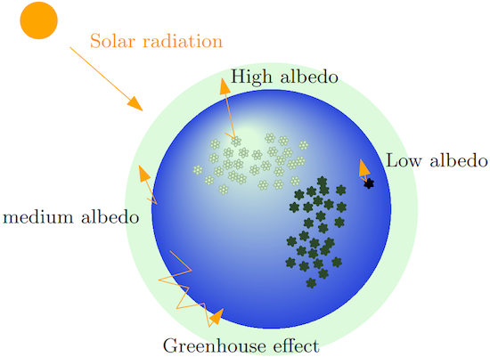
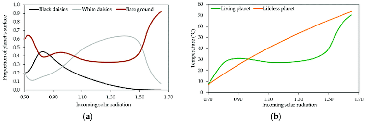

# The Basics of C++ Programming: week-long project

- [The Basics of C++ Programming: week-long project](#the-basics-of-c-programming-week-long-project)
  - [The Daisyworld simulation](#the-daisyworld-simulation)
  - [Project overview and day-by-day activities](#project-overview-and-day-by-day-activities)
  - [Bibliography](#bibliography)

## The Daisyworld simulation

**Daisyworld**  [[1]](#bibliography) is a computer simulation of a
_hypothetical world_ orbiting around a star whose radiant energy slowly varies
with time.

Its original version was introduced by James Lovelock and Andrew Watson as a
_toy model_ to show how **living creatures** (_biotas_) **and the environment**
they populate **evolve as an interconnected system**, one affecting the other.

**The only living beings** populating Daisyworld are (indeed) **daises**, that
(in the simplest model) exist in two varieties: _white-_ and _black-_ petaled.
**White-daisies** mostly _reflect light_, while **black-daisies** mostly absorb
light.

The light absorbed or reflected (_albedo_) by daisies, contributes to the
variation of the temperature of a local patch of land, or to the overall
Daisyworld average temperature, respectively.

The simulation **tracks the two daisy populations** and the Daisyworld **average
temperature** as the **star beams grow more powerful**.

Results [[2]](#bibliography) show that, as the radiation of the star
increases:

1. the fraction of Daisyworld populated by white and black daisies varies but,
   **the overall population remains almost constant** in a wide star radiation
   range;
2. similar conclusions hold true also for **temperature**, that **remains
   stable** in Daisyworld, if compared to a lifeless planet orbiting at the same
   distance, that is exposed to an identical stellar activity.

Several variants of the _toy model_ were developed over the years (e.g.
deterministic, as the one described above, or stochastic - some examples can be
found in [[3]](#bibliography) and[[4]](#bibliography)).

## Project overview and day-by-day activities

During the week you will be guided though the development of a _stochastic
Daisyworld_ model.

An overview of the project structure, highlighting the main concepts involved,
the simulation parameters and the evolution algorithm is available
[here](project_overview.md).

Every day, guidelines will be provided in order to _translate to C++_ what
described in the project overview page:

- [Monday](day1.md): working area configuration, use of _ClangFormat_,
  getting familiar with the `g++` compiler;
- [Tuesday](day2.md): writing functions and testing them with _doctest_;
- [Wednesday](day3.md): implementing Daisyworld components using C++ (1);
- [Thursday](day4.md): implementing Daisyworld components using C++ (2);
- [Friday](day5.md): compilation model, separation of the project into
  multiple files, use of _CMake_.

> :warning: the actual distribution of activities during each day's project
> development session is subject to variations to adapt to the topics covered
> until that moment during the lectures.

## Bibliography

[[1]](https://onlinelibrary.wiley.com/doi/abs/10.1111/j.1600-0889.1983.tb00031.x)
Watson, A.J.; Lovelock, J.E (1983). "Biological homeostasis of the global
environment: the parable of Daisyworld". Tellus. 35B (4): 286–9.

[[2]](https://www.mdpi.com/2073-4441/12/9/2510) Wilby R. (2020). "Resilience
Viewed through the Lens of Climate Change and Water Management". Water 2020,
12(9), 2510.

[[3]](https://gingerbooth.com/html5/daisy/help/index.html) An Online Daisyworld
simulator with many options, which includes and document both deterministic
and stochastic evolution models.

[[4]](http://ccl.northwestern.edu/netlogo/models/Daisyworld) A NetLogo version
of a stochastic Daisyworld model.
